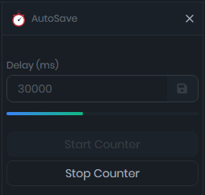
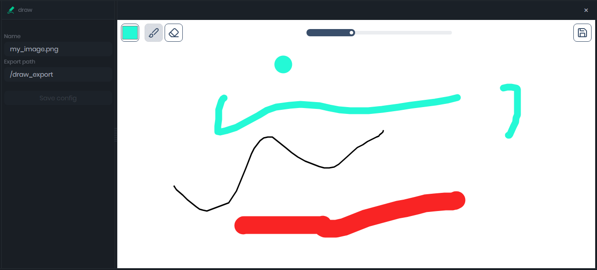
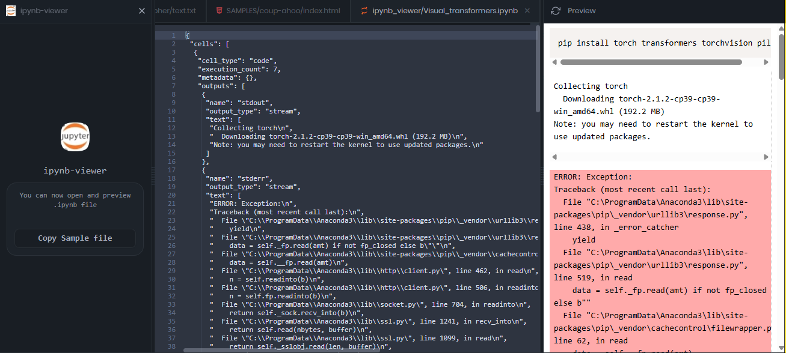
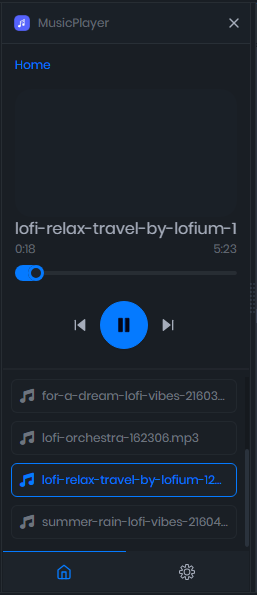

## Mobilecode Studio Extensions Repository
This repository serves as the public extension index for the Mobilecode Studio IDE online store, allowing users to browse and install extensions directly within the IDE.

> `.mcx` is the standard extension format for Mobilecode Studio.

---

Each folder represents a single extension and contains its versioned `.mcx` packages:

```
Extensions/
├── white-ball/
│   ├── icon.png
│   ├── white-ball_0.03.mcx
│   └── white-ball_0.04.mcx
├── another-extension/
│   ├── icon.png
│   ├── another-extension_1.0.0.mcx
│   └── another-extension_1.1.0.mcx
└── ...
```

* `icon.png`: Displayed in the online store inside the IDE.
* `*.mcx`: Installable extension packages. The IDE automatically detects and fetches the **latest version** based on the filename.

---

## Naming Rules

* Folder name = extension ID
* MCX filename must follow this format:

  ```
  <extension-id>_<version>.mcx
  ```

  Example: `white-ball_0.04.mcx`

---


## Previews

### Mobilecode Studio Extension Store

> Discover and install extensions directly from inside the IDE.


---

### AutoSave

> Automatically saves your project at regular intervals.



---

### Draw

> A simple drawing board extension. Sketch ideas quickly inside your workspace and save your drawings directly to your phone.



---

### IPynb Viewer

> View `.ipynb` (Jupyter Notebook) files directly in the IDE with syntax formatting.



---

### Music Player

> A minimal audio player embedded inside the IDE – code to your favorite lofi tunes.



---

## Game extension
> The video below demonstrates the interaction between a device and the IDE. The IDE successfully detects various inputs from the device, including swipe gestures, gyroscopic movement, and more.
[Watch the video](game-extensions.mp4)
